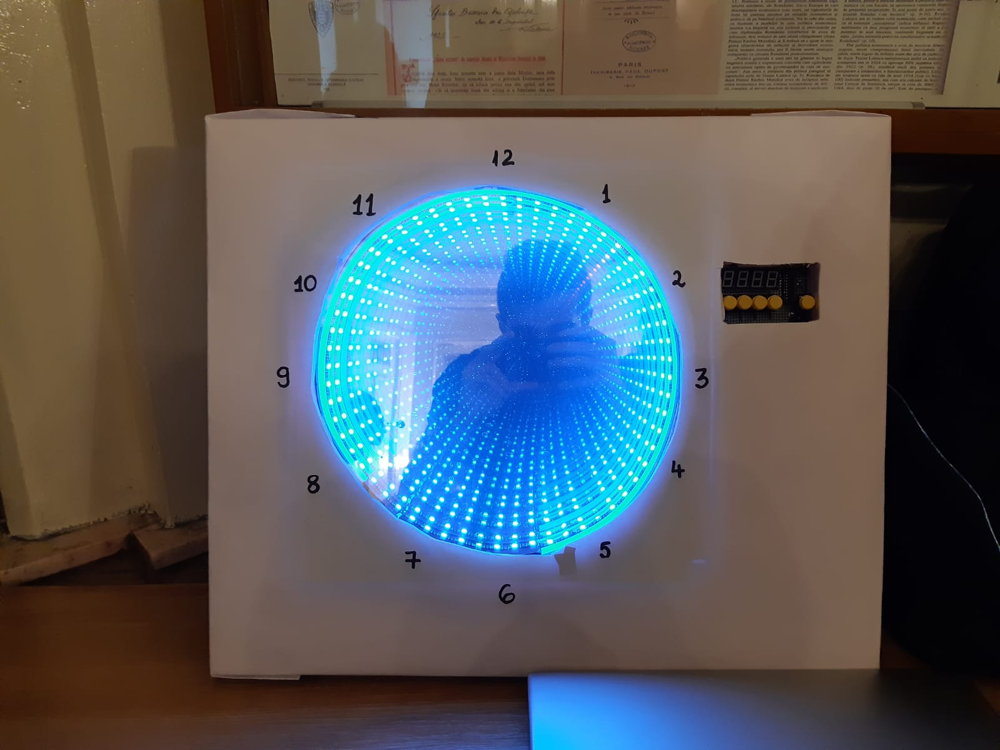

# Infinty clock with alarm

This project is made of 2 main components: an infinity mirror and an alarm.
The infinity mirror is made of 2 mirros facing one another. One of them is a normal mirror and the other has 70% opacity. There is a LED strip between the two mirrors which provides light that will reflect in both mirrors for an infitite amount of time, resulting in an interesting effect. The alarm consists of one 4 digit 7 segment display, 4 buttons which allow the user to choose/set the time and 1 button to activate the alarm. The sound of the alarm is provided by a buzzer.   

## How to play: 
The WS2812b LED strip consists of 60 individually adressable LEDs. There are 3 LED lights representing hours (red), minutes (green) and seconds (blue) which rotate in a clockwise direction. In order to set the alarm, the user has to pick the hour, using the first 2 buttons: the leftmost button for decreasing the value and the other one for increasing it. The minutes can be set by pressing the next 2 buttons, in the same way as before. The last button is used for activating the alarm. 

## Bill of materials (BOM):
https://docs.google.com/spreadsheets/d/1Htry010sDG5Vxl1XxuDkIDsEU6a6pIBbHVVmY9l-o_E/edit#gid=1402047340
 
 ## Used tutorial:
 https://www.youtube.com/watch?v=1SQDDCy3p5I&t=0s
 
 
 
 ## Photo of the project
 
 
 ## Video
 https://youtu.be/q1fAT-T3IGI
 
 ## Bugs
 In the video, the alarm part of the project doesn't work. This is because the circuit broke before the presentation, but the code is good.
 
